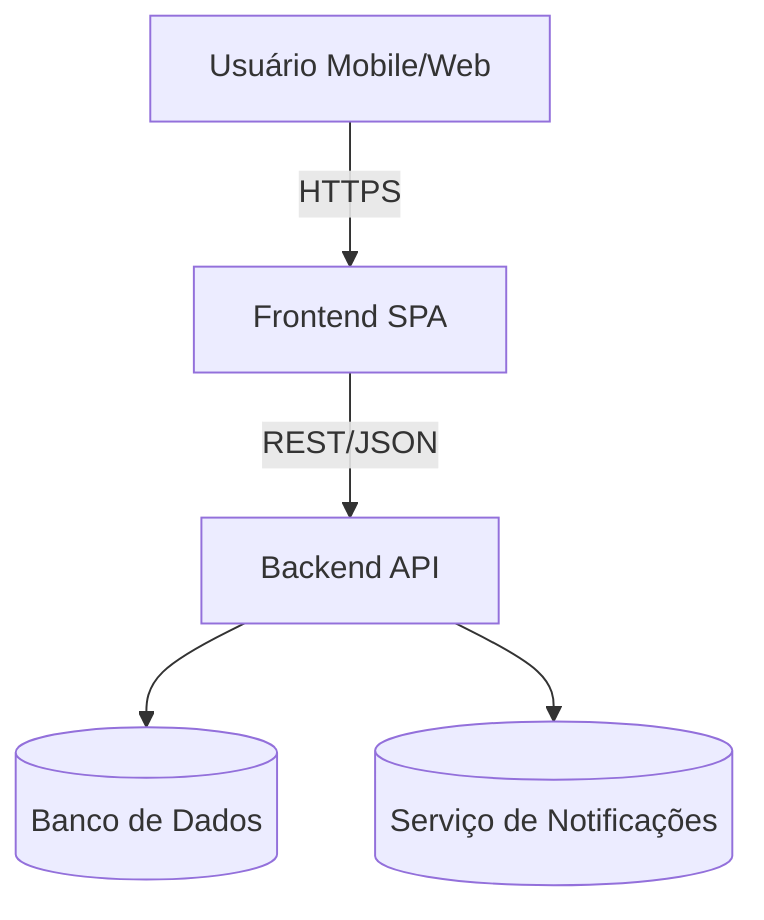
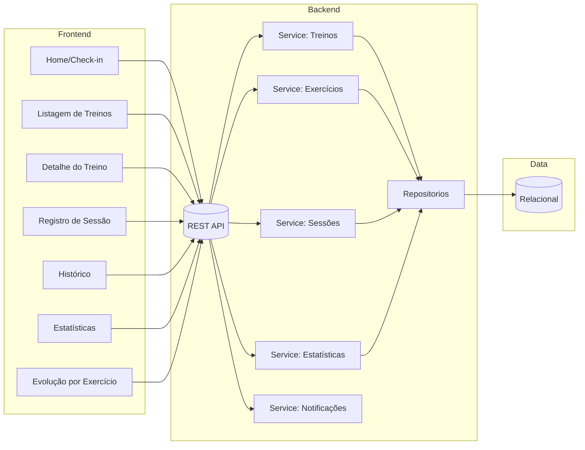
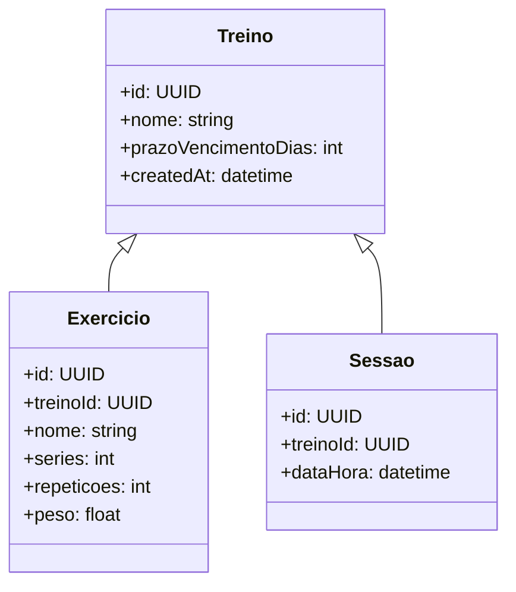

# Diagramas de Arquitetura — App de Treinos de Musculação

Base: `outputs/product-owner/requirements.md`, `user-stories.md`, `acceptance-criteria.md`, `backlog.md`.

## Visão Geral (MVP)

- Frontend: SPA mobile-first (ex.: React/Vite) hospedado estático.
- Backend: API simples (ex.: Node/Express ou NestJS) com endpoints de treinos, exercícios, sessões e estatísticas.
- DB: relacional leve (ex.: PostgreSQL).
- Notificações: inicialmente in-app (alertas), evoluindo para push quando houver infra.

## Componentes Principais

## Modelo de Dados (simplificado)

## Fluxos Críticos
- Check-in: Home → POST /sessoes → sucesso → atualizar histórico e estatísticas.
- Cadastro: POST /treinos, POST /exercicios → consistência via validações de domínio.
- Estatísticas: GET /estatisticas?periodo=mes → agregações simples por período.
- Vencimento: cálculo em leitura (última sessão + prazo), alertas in-app.

## Escalabilidade e Custos
- Estático + API básica → baixo custo inicial (orçamento gratuito).
- DB: Postgres;
- Notificações push adicionadas em fase posterior.

